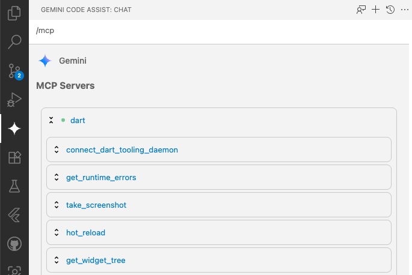

The Dart Tooling MCP Server exposes Dart and Flutter development tool actions to compatible AI-assistant clients.

## Status

WIP. This package is still experimental and is likely to evolve quickly.

## Set up your MCP client

<!-- Note: since many of our tools require access to the Dart Tooling Daemon, we may want
to be cautious about recommending tools where access to the Dart Tooling Daemon does not exist. -->

The Dart MCP server can work with any MCP client that supports standard I/O (stdio) as the
transport medium. To access all the features of the Dart MCP server, an MCP client must support
[Tools](https://modelcontextprotocol.io/docs/concepts/tools) and
[Resources](https://modelcontextprotocol.io/docs/concepts/resources). For the best development
experience with the Dart MCP server, an MCP client should also support
[Roots](https://modelcontextprotocol.io/docs/concepts/roots).

If you are using a client that claims it supports roots but does not actually
set them, pass `--force-roots-fallback` which will instead enable tools for
managing the roots.

Here are specific instructions for some popular tools:

### Gemini CLI

To configure the [Gemini CLI](https://github.com/google-gemini/gemini-cli) to use the Dart MCP
server, edit the `.gemini/settings.json` file in your local project (configuration will only
apply to this project) or edit the global `~/.gemini/settings.json` file in your home directory
(configuration will apply for all projects).

```json
{
  "mcpServers": {
    "dart": {
      "command": "dart",
      "args": [
        "mcp-server",
        "--experimental-mcp-server", // Can be removed for Dart 3.9.0 or later.
      ]
    }
  }
}
```

For more information, see the official Gemini CLI documentation for
[setting up MCP servers](https://github.com/google-gemini/gemini-cli/blob/main/docs/tools/mcp-server.md#how-to-set-up-your-mcp-server).

### Gemini Code Assist in VS Code

> Note: this currently requires the "Insiders" channel. Follow
[instructions](https://developers.google.com/gemini-code-assist/docs/use-agentic-chat-pair-programmer#before-you-begin)
to enable this build.

[Gemini Code Assist](https://codeassist.google/)'s
[Agent mode](https://developers.google.com/gemini-code-assist/docs/use-agentic-chat-pair-programmer) integrates the Gemini CLI to provide a powerful
AI agent directly in your IDE. To configure Gemini Code Assist to use the Dart MCP
server, follow the instructions to [configure the Gemini](#gemini-cli) CLI above.

You can verify the MCP server has been configured properly by typing `/mcp` in the chat window in Agent mode.



For more information see the official Gemini Code Assist documentation for
[using agent mode](https://developers.google.com/gemini-code-assist/docs/use-agentic-chat-pair-programmer#before-you-begin).

<!-- ### Android Studio -->
<!-- TODO(https://github.com/dart-lang/ai/issues/199): once we are confident that the
Dart MCP server will work well with Android Studio's MCP support, add documentation here
for configuring the server in Android Studio. -->

### Cursor

[](https://cursor.com/install-mcp?name=dart&config=eyJ0eXBlIjoic3RkaW8iLCJjb21tYW5kIjoiZGFydCBtY3Atc2VydmVyIC0tZXhwZXJpbWVudGFsLW1jcC1zZXJ2ZXIgLS1mb3JjZS1yb290cy1mYWxsYmFjayJ9)

The easiest way to configure the Dart MCP server with Cursor is by clicking the "Add to Cursor"
button above. 

Alternatively, you can configure the server manually. Go to **Cursor -> Settings -> Cursor Settings > Tools & Integrations**, and then click **"Add Custom MCP"** or **"New MCP Server"**
depending on whether you already have other MCP servers configured. Edit the `.cursor/mcp.json` file in your local project (configuration will only apply to this project) or
edit the global `~/.cursor/mcp.json` file in your home directory (configuration will apply for
all projects) to configure the Dart MCP server:

```json
{
  "mcpServers": {
    "dart": {
      "command": "dart",
      "args": [
        "mcp-server",
        "--experimental-mcp-server", // Can be removed for Dart 3.9.0 or later
        "--force-roots-fallback" // Workaround for a Cursor issue with Roots support
      ]
    }
  }
}
```

For more information, see the official Cursor documentation for
[installing MCP servers](https://docs.cursor.com/context/model-context-protocol#installing-mcp-servers).

### GitHub Copilot in VS Code

<!-- TODO: once the dart.mcpServer setting is not hidden, we may be able
to provide a deep link to the Dart Extension Settings UI for users to
enable the server. See docs: https://code.visualstudio.com/docs/configure/settings#_settings-editor.
This may be preferable to adding the deep link button to VS Code's mcp settings. -->

To configure the Dart MCP server with Copilot or any other AI agent that supports the
[VS Code MCP API](https://code.visualstudio.com/api/extension-guides/mcp), add the following
to your VS Code user settings:
```json
"dart.mcpServer": true
```

By adding this setting, the Dart VS Code extension will register the Dart MCP Server
configuration with VS Code so that you don't have to manually configure the server.
Copilot will then automatically configure the Dart MCP server on your behalf. This is
a global setting.

Alternatively, you can click the "Add to VS Code" button below to manually configure the server
in your VS Code user settings.

[](https://vscode.dev/redirect?url=vscode:mcp/install?%7B%22name%22%3A%22dart%22%2C%22command%22%3A%22dart%22%2C%22args%22%3A%5B%22mcp-server%22%2C%22--experimental-mcp%22%5D%7D)

Or, you can manually edit the `.vscode/mcp.json` file in your workspace,
which will only configure the Dart MCP server for the local workspace:

```json
"servers": {
  "dart": {
    "type": "stdio",
    "command": "dart",
    "args": [
      "mcp-server",
      "--experimental-mcp-server", // Can be removed for Dart 3.9.0 or later
    ]
  }
}
```

For more information, see the official VS Code documentation for
[enabling MCP support](https://code.visualstudio.com/docs/copilot/chat/mcp-servers#_enable-mcp-support-in-vs-code).

## Tools

| Tool Name | Feature Group | Description |
| --- | --- | --- |
| `analyze_files` | `static analysis` | Analyzes the entire project for errors. |
| `signature_help` | `static_analysis` | Gets signature information for usage at a given cursor position. |
| `hover` | `static_analysis` | Gets the hover information for a given cursor position. |
| `resolve_workspace_symbol` | `static analysis` | Look up a symbol or symbols in all workspaces by name. |
| `dart_fix` | `static tool` | Runs `dart fix --apply` for the given project roots. |
| `dart_format` | `static tool` | Runs `dart format .` for the given project roots. |
| `pub` | `static tool` | Runs a `dart pub` command for the given project roots. |
| `pub_dev_search` | `package search` | Searches pub.dev for packages relevant to a given search query. |
| `get_runtime_errors` | `runtime analysis` | Retrieves the list of runtime errors that have occurred in the active Dart or Flutter application. |
| `take_screenshot` | `runtime analysis` | Takes a screenshot of the active Flutter application in its current state. |
| `get_widget_tree` | `runtime analysis` | Retrieves the widget tree from the active Flutter application. |
| `get_selected_widget` | `runtime analysis` | Retrieves the selected widget from the active Flutter application. |
| `hot_reload` | `runtime tool` | Performs a hot reload of the active Flutter application. |
| `connect_dart_tooling_daemon`* | `configuration` | Connects to the locally running Dart Tooling Daemon. |
| `get_active_location` | `editor` | Gets the active cursor position in the connected editor (if available). |
| `run_tests` | `static tool` | Runs tests for the given project roots. |
| `create_project` | `static tool` | Creates a new Dart or Flutter project. |

> *Experimental: may be removed.
